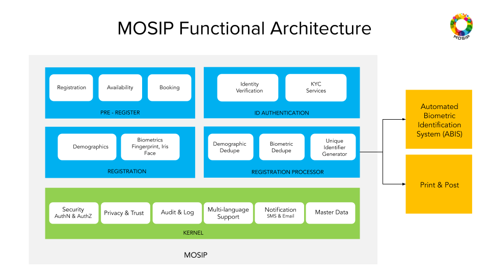

# Architecture Principles 
[Architecture Principles](MOSIP-Architecture-Principles.md)

# Modules 
* [Pre-Registration](Pre-Registration.md) 
* Registration
* Registration Processor
* ID Authentication
* Resident Services
* Partner Management
* Admin

# Functional Architecture
 

# Logical Architecture
 

# Data Architecture
[MOSIP Data Architecture](MOSIP-Data-Architecture.md) 

# Design choices
* Microservice based architecture for all platform services for modularity and scalability.
* Staged Event Driven Architecture (SEDA) for processing Registration data for extensibility.
* Thick client architecture for Registration client
