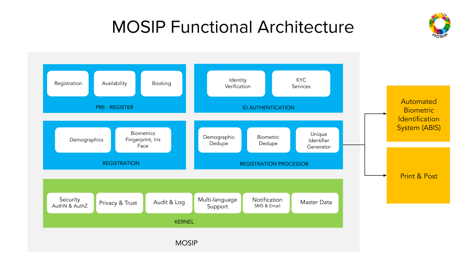

# Architecture Principles
[Architecture Principles](MOSIP-Architecture-Principles.md)

# Modules3

* [doc1](Pre-Registration.md)
* [doc2](Registration-Processor.md)
* [doc3](Registration-Client.md)
* [doc4](ID-Authentication.md)
* [doc5](Resident-Services.md)
* [doc5](Partner-Management.md)
* [doc7](Admin.md)

# Functional Architecture

# Logical Architecture

# Data Architecture

[MOSIP Data Architecture](MOSIP-Data-Architecture.md)

# Design choices
* Microservice based architecture for all platform services for modularity and scalability.
* Staged Event Driven Architecture (SEDA) for processing Registration data for extensibility.
* Thick client architecture for Registration client
