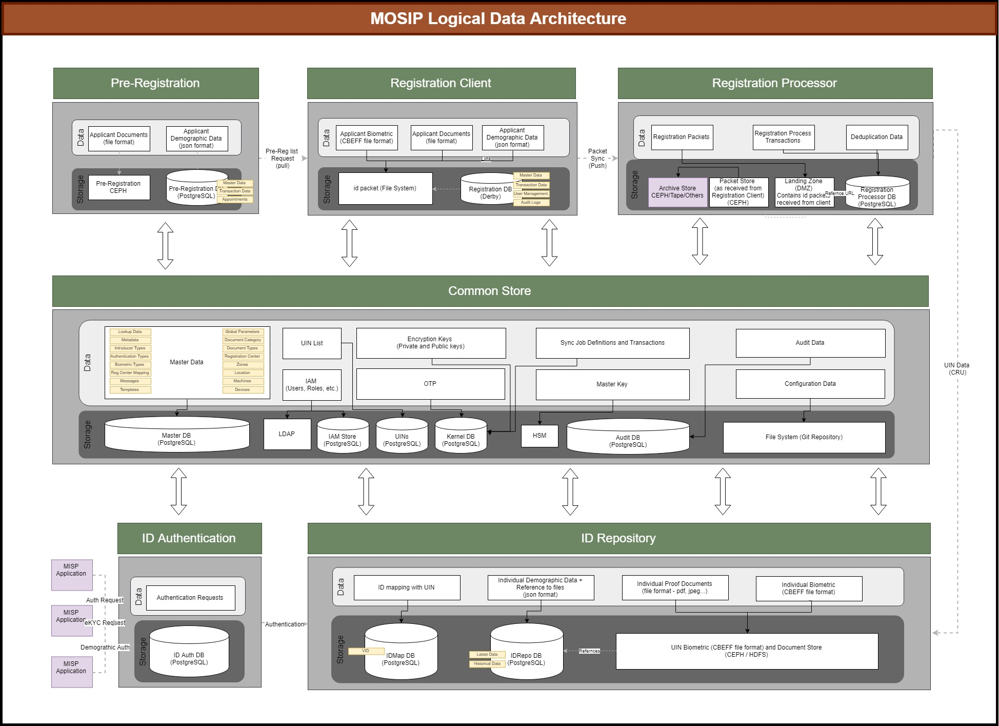

## Data Architecture Principles

* PII of an individual like name, age, gender, address etc... and other sensitive information must be signed and stored in an encrypted form
* Documents and images must not be stored in a database table. They must be stored in a file system and referenced in DB.
* No business logic applied at database level, only Primary, Unique, foreign keys and not-null are applied. Foreign keys are applied within the same database, if a table is referenced in another database then no FK is applied
* Database specific features like triggers, DB functions like sequence generators etc.… must not be used in MOSIP. This avoids vendor lock-in
* Surrogate key, wherever used, must be a random number and not be generated based on the record data.
* Direct queries on the database by a human must not be made. Database administrators must ensure this control during database configuration setup
* Database is setup in UTF-8*** file format to support multiple languages
* Following datatypes are used

      -Character Varying
      -Timestamp
      -Date
      -Integer
      -Number
      -Bytea/blob
      -Boolean

## Logical view of MOSIP data system

## Security

In MOSIP, the following users are defined to perform various activities and have control over the DB objects that are defined
* **sysadmin:** sysadmin user is a super administrator role, who will have all the privileges to perform any task within the database. Currently all the objects are being owned by sysadmin.
* **dbadmin:** dbadmin user is created to handle all the database administration activities like monitoring, performance tuning, backups, restore, replication setup, etc.
* **appadmin:** appadmin user is used to perform all the DDL tasks. All the db objects that are created in these databases will be owned by appadmin user.
* **Application User:** Each module will have a user created to perform DML tasks like CRUD operations. Will have masteruser, prereguser, idauser, idrepouser, idmapuser, kerneluser, audituser, regprcuser to perform tasks in respective modules.

**Note:** From the above set of roles only application user is specific to a module. The other users are common which needs to be created per PostgreSQL db instance.

## Multi-Language

MOSIP platform is being built for multiple countries, there is a need to support multiple languages. So as per the requirements, MOSIP will support multiple languages as configured by the country level administrator. Multi language support is needed for the following datasets. 

* Master Data
* ID data of an individual
* Transaction comments
* Labels used in UI
* Messages and notifications

From database side, the data will support **UTF-8 Unicode character set** to store data entered in multiple languages. 
There will not be any in-built support to translate data at database level. Any translation or transliteration will be handled at API or UI layer.

## Performance

To support performance, following database design features are to be considered

* Database sharding: By default, sharding algorithm is not applied in MOSIP system. SI can define the sharding algorithm based on the deployment setup
* All tables will have a primary key index on the primary key field. This will help in faster retrievals and joins
* All foreign keys will have indexes defined so that it will help in faster joins
* No referential integrity is applied on tables across databases
* Partitioning: Partitioning design to be discussed as PostgreSQL has certain limitation / different way of implementation that requires specific database features to be applied. 

## Data Model Naming Standards

[Naming Standards](Data-Model-Naming-Standards.md)

## Data Model
[Data Model](MOSIP-Data-Model.md)

## Data encryption
[Encryption in DTO Layer](Encryption-in-DTO-Layer)
