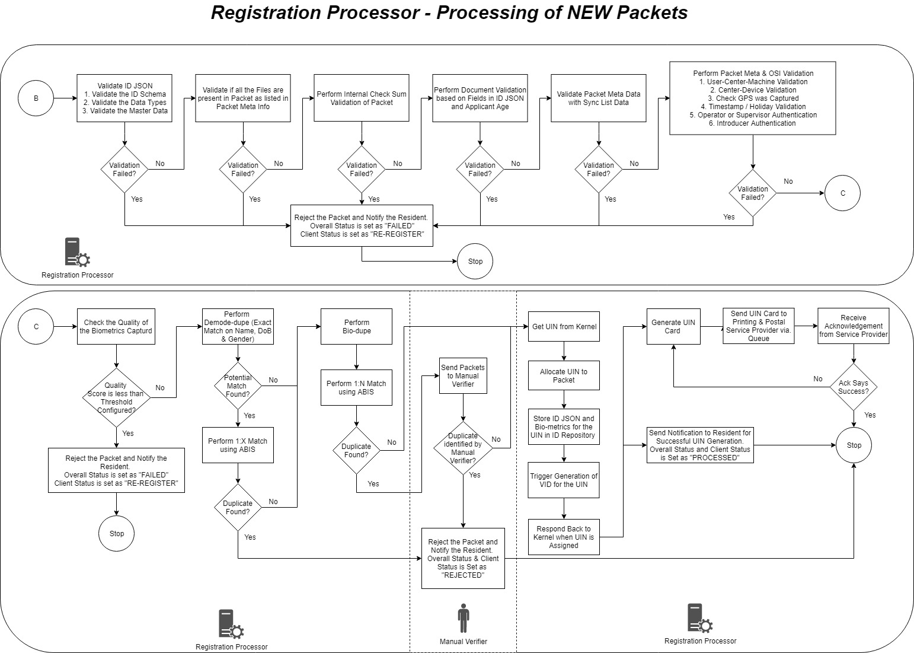
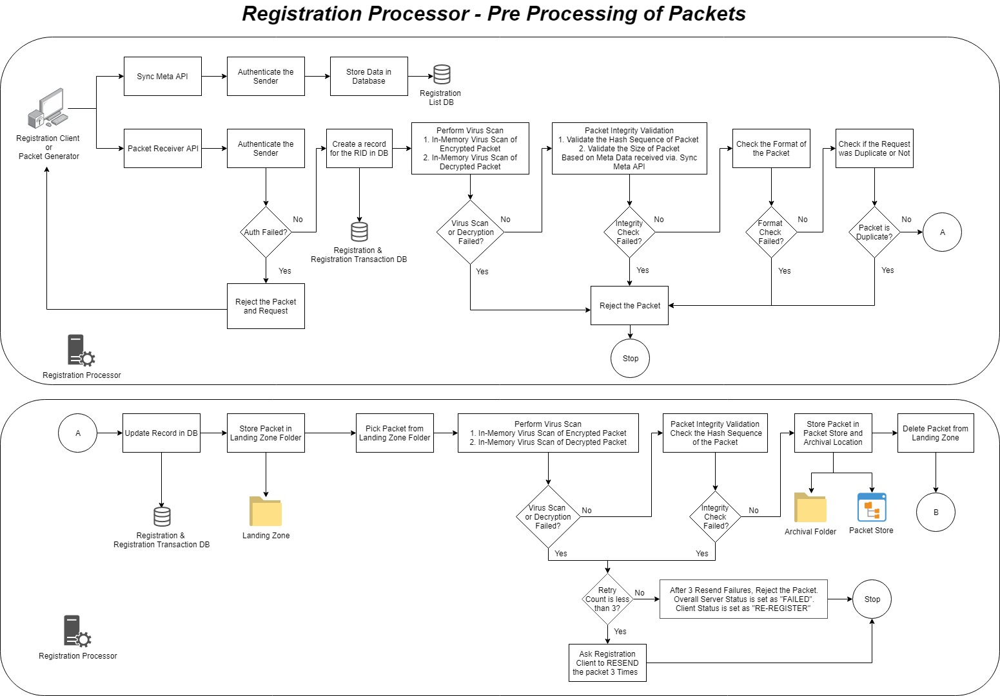
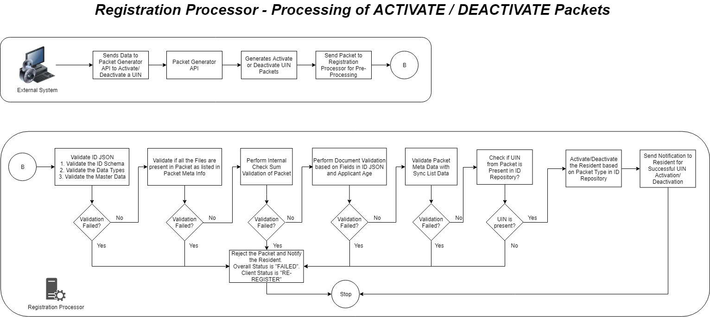

# Overview
Registration Processor processes the data (demographic and biometric) of an Individual for quality and uniqueness and then issues a Unique Identification Number (UIN). It also provides functionality to update demographic and biometric data and issue a new UIN if lost.  The source of data are primarily from
- MOSIP Registration Client
- Existing ID system(s) of a country

# Detailed functionality
[Registration Processor Functionality](Registration-Processor-Functionality)

# Process flow

&nbsp;  
&nbsp; 

&nbsp;  
&nbsp;

&nbsp;  
&nbsp;

&nbsp;  
&nbsp;

## Architecturally significant use cases
### Registration processor must provide guaranteed packet processing
Once the packet is received on the server, processor must guarantee packet processing. So, the solution has to take care of the following
- Not lose the packet once received on the server
- Handle server failure, recovery and re-submission of packets for processing automatically

### Registration processor must have the capability to add new processing step(s) without changing existing steps
MOSIP will only define and implement the basics registration packet processing flow. However, every country will have their own processing requirements and MOSIP should be flexible to include new processing steps. For example, a country may want to integrate with their existing ID system and fetch data from it, validate it with data captured in MOSIP before processing. So, MOSIP should provide the option to include a new step.

### Registration processor must have the capability to integrate with multiple ABIS providers
MOSIP must be capable of leveraging multiple ABIS providers to achieve better data processing and de-duplication. One ABIS may be good in fingerprint de-duplication and another in Iris de-duplication. So, MOSIP's design should accommodate sending one or more biometric modality to one or more ABISs and get calculate a composite fusion score and then take a decision on the processing. This also helps to encourage multiple 3rd party systems to compete and provide good systems.

### Each processing step must be scalable independently based on the load
Packet processing will have multiple stages and each stage will vary in its computing complexity. For example, a data validation stage may be low complexity compared to a biometric de-duplication stage. So, it should be possible to scale biometric de-duplication stage independently to meet the processing performance.

### Each step must be highly available for uninterrupted processing of packets

### Upgradeability : Each step in the processor must be independent of other steps such that logic of a step can be changed to improve efficiency without affecting the overall flow

# Services
For detailed description of Registration Processor Services refer to [registration processor repo](https://github.com/mosip/registration/registration-processor).

For high level and low level design refer to [registration processor repo](https://github.com/mosip/registration/registration-processor)

# Build and deploy
Refer to build and deploy instructions in [registration processor repo](https://github.com/mosip/registration/registration-processor).

# APIs
[Registration Processor APIs](Registration-Processor-APIs)

