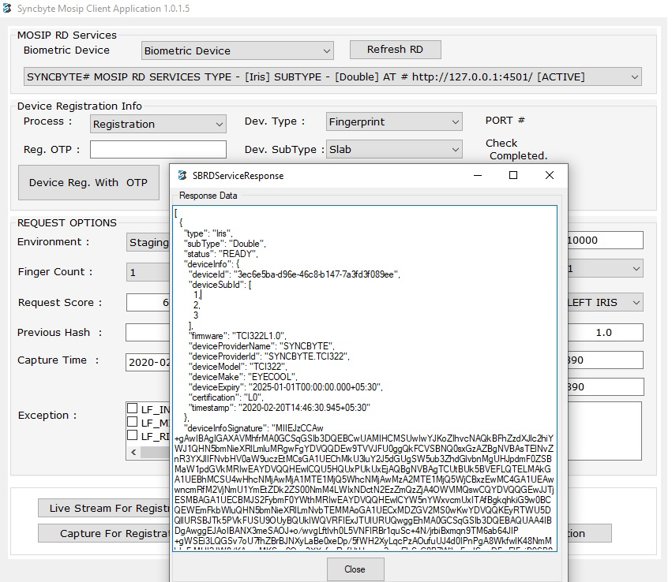

# Steps to Register a Device

Please find the list of devices to be registered.
1. Fingerprint Slap scanner
2. IRIS
3. Camera

# Pre-Requisite

Devices need to be linked in the computer using client application using OTP.

Using the MosipClient.exe application get the Device Specification info. 
Please follow the steps to register a device using the device specification info.

# Steps for Registering a Device in MOSIP

## 1. Retrieve Device Specification

Open the MosipClient.exe application and click on the device info. You would get all the required info for the linked devices: Fingerprint Slap scanner, IRIS, Camera for registration.



## 2. Create Device Provider

If the device provider details is not available in device_provider table, using the [Device Provider API](https://github.com/mosip/documentation/wiki/Device-Management#post-deviceprovider), add the device provider details to device_provider table.

## 3. Create MOSIP Device Service (MDS) 
If the MOSIP Device Service is not available in mosip_device_service table, using the [MOSIP Device Services API](https://github.com/mosip/documentation/wiki/Device-Management#post-mosipdeviceservice
), add the MOSIP Device Service to mosip_device_service table.

## 4. Create Device Specification

If the device specifications are not available in device_spec table, using the [Device Specification API](https://github.com/mosip/documentation/wiki/Device-APIs#post-devicespecifications), add the device specification details to device_spec table.

## 5. Create Device

If the devices are not available in device_master table, using the [Device API](https://github.com/mosip/documentation/wiki/Device-APIs#post-devices), add the device details to device_master table.

## 6. Map Devices to Centers 

Once all the devices are stored in device_master, use [Center Device Mapping API](https://github.com/mosip/documentation/wiki/Registration-Center-APIs#registration-center-device-api) to map the devices to the respective centers.

## 7. Register Devices

If the devices are not available in registered_device_master table then, use the below steps to register the devices in MOSIP.

A. Extract the Digital ID details using Device Specification Info from MosipClient.exe application. Below JSON structure is an example for the Digital ID of a single finger print device.

```JSON
{
              "serialNo": "987452348",
              "deviceProvider": "SYNCBYTE_MANTRA",
              "deviceProviderId": "SYNCBYTE.MC01A_MANTRA01A",
              "make": "MC01ALAWJD",
              "model": "SMIDCLUYTO",
              "dateTime": "2020-01-13T07:20:42.195Z",
              "type": "Fingerprint",
              "subType": "Single"
}
```

B. Encode the above JSON using Base64Encoding ([Vist this Website to Encode the JSON](https://www.base64encode.org/))

Encoded Digital ID
```
eyJzZXJpYWxObyI6IjE4MDExNjA5OTIiLCJkZXZpY2VQcm92aWRlciI6IlNZTkNCWVRFIiwiZGV2aWNlUHJvdmlkZXJJZCI6IlNZTkNCWVRFLk1DMDFBIiwibWFrZSI6Ik1DMDFBIiwibW9kZWwiOiJTTUlEQ0wiLCJkYXRlVGltZSI6IjIwMjAtMDEtMTNUMDc6MjA6NDIuMTk1WiIsInR5cGUiOiJGaW5nZXJwcmludCIsInN1YlR5cGUiOiJTaW5nbGUifQ==
```

C. Place the Encoded Digital ID in the Device Registration JSON. Below is an example for the JSON structure of Device Device Data used for Device Registration.

```JSON
{
              "deviceId": "lkjsd2343dkfa-d96e-46c8-b147-7Jg5f5d6k99ee",
              "purpose": "REGISTRATION",
              "deviceInfo": {
                             "deviceSubId": "1",
                             "certification": "L0",
                             "digitalId": "eyJzZXJpYWxObyI6IjE4MDExNjA5OTIiLCJkZXZpY2VQcm92aWRlciI6IlNZTkNCWVRFIiwiZGV2aWNlUHJvdmlkZXJJZCI6IlNZTkNCWVRFLk1DMDFBIiwibWFrZSI6Ik1DMDFBIiwibW9kZWwiOiJTTUlEQ0wiLCJkYXRlVGltZSI6IjIwMjAtMDEtMTNUMDc6MjA6NDIuMTk1WiIsInR5cGUiOiJGaW5nZXJwcmludCIsInN1YlR5cGUiOiJTaW5nbGUifQ==",
                             "firmware": "firmware",
                             "deviceExpiry": "2020-01-13T12:50:42.196Z",
                             "timeStamp": "2020-01-13T12:50:42.208Z"
              },
              "foundationalTrustProviderId": ""
}
```

D. Encode the above JSON using Base64Encoding ([Vist this Website to Encode the JSON](https://www.base64encode.org/))

Encoded Device Data :

```
ewogICAgICAgICAgICAgICJkZXZpY2VJZCI6ICIzZWM2ZTViYS1kOTZlLTQ2YzgtYjE0Ny03YTNmZDNmMDg5ZWUiLAogICAgICAgICAgICAgICJwdXJwb3NlIjogIlJFR0lTVFJBVElPTiIsCiAgICAgICAgICAgICAgImRldmljZUluZm8iOiB7CiAgICAgICAgICAgICAgICAgICAgICAgICAgICAgImRldmljZVN1YklkIjogIjEiLAogICAgICAgICAgICAgICAgICAgICAgICAgICAgICJjZXJ0aWZpY2F0aW9uIjogIkwwIiwKICAgICAgICAgICAgICAgICAgICAgICAgICAgICAiZGlnaXRhbElkIjogImV5SnpaWEpwWVd4T2J5STZJakU0TURFeE5qQTVPVElpTENKa1pYWnBZMlZRY205MmFXUmxjaUk2SWxOWlRrTkNXVlJGSWl3aVpHVjJhV05sVUhKdmRtbGtaWEpKWkNJNklsTlpUa05DV1ZSRkxrMURNREZCSWl3aWJXRnJaU0k2SWsxRE1ERkJJaXdpYlc5a1pXd2lPaUpUVFVsRVEwd2lMQ0prWVhSbFZHbHRaU0k2SWpJd01qQXRNREV0TVROVU1EYzZNakE2TkRJdU1UazFXaUlzSW5SNWNHVWlPaUpHYVc1blpYSndjbWx1ZENJc0luTjFZbFI1Y0dVaU9pSlRhVzVuYkdVaWZRPT0iLAogICAgICAgICAgICAgICAgICAgICAgICAgICAgICJmaXJtd2FyZSI6ICJmaXJtd2FyZSIsCiAgICAgICAgICAgICAgICAgICAgICAgICAgICAgImRldmljZUV4cGlyeSI6ICIyMDIwLTAxLTEzVDEyOjUwOjQyLjE5NloiLAogICAgICAgICAgICAgICAgICAgICAgICAgICAgICJ0aW1lU3RhbXAiOiAiMjAyMC0wMS0xM1QxMjo1MDo0Mi4yMDhaIgogICAgICAgICAgICAgIH0sCiAgICAgICAgICAgICAgImZvdW5kYXRpb25hbFRydXN0UHJvdmlkZXJJZCI6ICIiCn0=
```

E. Use the encoded device data to register the devices in MOSIP using the [Device Registration API](https://github.com/mosip/documentation/wiki/Device-Management#post-registereddevices)

```JSON
 {
  "id": "string",
  "metadata": {},
  "request": {
    "deviceData": "ewogICAgICAgICAgICAgICJkZXZpY2VJZCI6ICIzZWM2ZTViYS1kOTZlLTQ2YzgtYjE0Ny03YTNmZDNmMDg5ZWUiLAogICAgICAgICAgICAgICJwdXJwb3NlIjogIlJFR0lTVFJBVElPTiIsCiAgICAgICAgICAgICAgImRldmljZUluZm8iOiB7CiAgICAgICAgICAgICAgICAgICAgICAgICAgICAgImRldmljZVN1YklkIjogIjEiLAogICAgICAgICAgICAgICAgICAgICAgICAgICAgICJjZXJ0aWZpY2F0aW9uIjogIkwwIiwKICAgICAgICAgICAgICAgICAgICAgICAgICAgICAiZGlnaXRhbElkIjogImV5SnpaWEpwWVd4T2J5STZJakU0TURFeE5qQTVPVElpTENKa1pYWnBZMlZRY205MmFXUmxjaUk2SWxOWlRrTkNXVlJGSWl3aVpHVjJhV05sVUhKdmRtbGtaWEpKWkNJNklsTlpUa05DV1ZSRkxrMURNREZCSWl3aWJXRnJaU0k2SWsxRE1ERkJJaXdpYlc5a1pXd2lPaUpUVFVsRVEwd2lMQ0prWVhSbFZHbHRaU0k2SWpJd01qQXRNREV0TVROVU1EYzZNakE2TkRJdU1UazFXaUlzSW5SNWNHVWlPaUpHYVc1blpYSndjbWx1ZENJc0luTjFZbFI1Y0dVaU9pSlRhVzVuYkdVaWZRPT0iLAogICAgICAgICAgICAgICAgICAgICAgICAgICAgICJmaXJtd2FyZSI6ICJmaXJtd2FyZSIsCiAgICAgICAgICAgICAgICAgICAgICAgICAgICAgImRldmljZUV4cGlyeSI6ICIyMDIwLTAxLTEzVDEyOjUwOjQyLjE5NloiLAogICAgICAgICAgICAgICAgICAgICAgICAgICAgICJ0aW1lU3RhbXAiOiAiMjAyMC0wMS0xM1QxMjo1MDo0Mi4yMDhaIgogICAgICAgICAgICAgIH0sCiAgICAgICAgICAgICAgImZvdW5kYXRpb25hbFRydXN0UHJvdmlkZXJJZCI6ICIiCn0="
  },
  "requesttime": "2018-12-10T06:12:52.994Z",
  "version": "string"
}
```

# Steps to Verify if Device is Registered Successfully

We can Verify if the device is registered using the registered_device_master table or by viewing the below response:

Response of Device Registration API: 

```JSON
{
    "id": "string",
    "version": "string",
    "responsetime": "2020-01-13T07:25:29.764Z",
    "metadata": null,
    "response": "eyJhbGciOiJSUzI1NiIsInR5cGUiOiJKV1MifQ==.eyJzdGF0dXMiOiJSRUdJU1RFUkVEIiwiZGlnaXRhbElkIjoiZXlKelpYSnBZV3hPYnlJNklqRTRNREV4TmpBNU9USWlMQ0prWlhacFkyVlFjbTkyYVdSbGNpSTZJbE5aVGtOQ1dWUkZJaXdpWkdWMmFXTmxVSEp2ZG1sa1pYSkpaQ0k2SWxOWlRrTkNXVlJGTGsxRE1ERkJJaXdpYldGclpTSTZJazFETURGQklpd2liVzlrWld3aU9pSlRUVWxFUTB3aUxDSmtZWFJsVkdsdFpTSTZJakl3TWpBdE1ERXRNVE5VTURjNk1qQTZOREl1TVRrMVdpSXNJblI1Y0dVaU9pSkdhVzVuWlhKd2NtbHVkQ0lzSW5OMVlsUjVjR1VpT2lKVGFXNW5iR1VpZlEiLCJkZXZpY2VDb2RlIjoiOGNkNDI4NjQtMmNkYy00MDY3LThkMTEtNDBiMjVmZjhjNzYwIiwiZW52IjoibG9jYWwiLCJ0aW1lU3RhbXAiOiIyMDIwLTAxLTEzVDEyOjU1OjI5LjkxOFoifQ==.dkd3Mlo2TStDT2JpM1lHY2Q1OFNJRkJ6T0E5bFZ6dUFlZnN3NHhQZzEzWE42LzAvWVZ6Qm0yNnpmZXFPRXdmWHNKQUN4aC9QNExuM2RHcjhSR2diZjEvRXgwNktCOEhhbEM1VjhPMFh4VGxmK3ZSZFlJeTZhbFh0cS8rY0s0VjRSYUpHYjVDL2kweHdzMFF3bHh0UEo4cFIvbnVrb1d5dzNNTmRDSkNZaVlGSkxVUUpKbnhyaEtYR3dvM1ZlcVNkaEYrMStjS1ZpSzFWSlQ5OHFsMjFhTUp0MGd4Wko1Rzg5V0lSbi9yTnU1Slg1N0c0dnNya1JhN3JEUURsNDI5dEdkT3RYYVJYK3dOb0FESmI5V0psOFlLOW5hUFkyNExkZ3FkOXRydEw2VUoyaTc5ek1Qclk0cjhIQWFQaXlxc0REQmRPVFdhanN5VmhOODFuU0JCQ0tBPT0=",
    "errors": null
}
```

The response received is grouped into three parts as Header, Payload and Signature which is in JWT (Java Web Token) format.

```
<header>
eyJhbGciOiJSUzI1NiIsInR5cGUiOiJKV1MifQ== 
</header>
<payload>
eyJzdGF0dXMiOiJSRUdJU1RFUkVEIiwiZGlnaXRhbElkIjoiZXlKelpYSnBZV3hPYnlJNklqRTRNREV4TmpBNU9USWlMQ0prWlhacFkyVlFjbTkyYVdSbGNpSTZJbE5aVGtOQ1dWUkZJaXdpWkdWMmFXTmxVSEp2ZG1sa1pYSkpaQ0k2SWxOWlRrTkNXVlJGTGsxRE1ERkJJaXdpYldGclpTSTZJazFETURGQklpd2liVzlrWld3aU9pSlRUVWxFUTB3aUxDSmtZWFJsVkdsdFpTSTZJakl3TWpBdE1ERXRNVE5VTURjNk1qQTZOREl1TVRrMVdpSXNJblI1Y0dVaU9pSkdhVzVuWlhKd2NtbHVkQ0lzSW5OMVlsUjVjR1VpT2lKVGFXNW5iR1VpZlEiLCJkZXZpY2VDb2RlIjoiOGNkNDI4NjQtMmNkYy00MDY3LThkMTEtNDBiMjVmZjhjNzYwIiwiZW52IjoibG9jYWwiLCJ0aW1lU3RhbXAiOiIyMDIwLTAxLTEzVDEyOjU1OjI5LjkxOFoifQ==
</payload>
<signature>
dkd3Mlo2TStDT2JpM1lHY2Q1OFNJRkJ6T0E5bFZ6dUFlZnN3NHhQZzEzWE42LzAvWVZ6Qm0yNnpmZXFPRXdmWHNKQUN4aC9QNExuM2RHcjhSR2diZjEvRXgwNktCOEhhbEM1VjhPMFh4VGxmK3ZSZFlJeTZhbFh0cS8rY0s0VjRSYUpHYjVDL2kweHdzMFF3bHh0UEo4cFIvbnVrb1d5dzNNTmRDSkNZaVlGSkxVUUpKbnhyaEtYR3dvM1ZlcVNkaEYrMStjS1ZpSzFWSlQ5OHFsMjFhTUp0MGd4Wko1Rzg5V0lSbi9yTnU1Slg1N0c0dnNya1JhN3JEUURsNDI5dEdkT3RYYVJYK3dOb0FESmI5V0psOFlLOW5hUFkyNExkZ3FkOXRydEw2VUoyaTc5ek1Qclk0cjhIQWFQaXlxc0REQmRPVFdhanN5VmhOODFuU0JCQ0tBPT0=
</signature>
```

### Header 

Encoded Header:
```
eyJhbGciOiJSUzI1NiIsInR5cGUiOiJKV1MifQ==
```

Decoded Header: 
```JSON
{
              "alg": "RS256",
              "type": "JWS"
}
```

### Payload 

Encoded Payload: 
```
eyJzdGF0dXMiOiJSRUdJU1RFUkVEIiwiZGlnaXRhbElkIjoiZXlKelpYSnBZV3hPYnlJNklqRTRNREV4TmpBNU9USWlMQ0prWlhacFkyVlFjbTkyYVdSbGNpSTZJbE5aVGtOQ1dWUkZJaXdpWkdWMmFXTmxVSEp2ZG1sa1pYSkpaQ0k2SWxOWlRrTkNXVlJGTGsxRE1ERkJJaXdpYldGclpTSTZJazFETURGQklpd2liVzlrWld3aU9pSlRUVWxFUTB3aUxDSmtZWFJsVkdsdFpTSTZJakl3TWpBdE1ERXRNVE5VTURjNk1qQTZOREl1TVRrMVdpSXNJblI1Y0dVaU9pSkdhVzVuWlhKd2NtbHVkQ0lzSW5OMVlsUjVjR1VpT2lKVGFXNW5iR1VpZlEiLCJkZXZpY2VDb2RlIjoiOGNkNDI4NjQtMmNkYy00MDY3LThkMTEtNDBiMjVmZjhjNzYwIiwiZW52IjoibG9jYWwiLCJ0aW1lU3RhbXAiOiIyMDIwLTAxLTEzVDEyOjU1OjI5LjkxOFoifQ==
```

Decoded Header:
```JSON
{
  "status": "REGISTERED",
  "digitalId": "eyJzZXJpYWxObyI6IjE4MDExNjA5OTIiLCJkZXZpY2VQcm92aWRlciI6IlNZTkNCWVRFIiwiZGV2aWNlUHJvdmlkZXJJZCI6IlNZTkNCWVRFLk1DMDFBIiwibWFrZSI6Ik1DMDFBIiwibW9kZWwiOiJTTUlEQ0wiLCJkYXRlVGltZSI6IjIwMjAtMDEtMTNUMDc6MjA6NDIuMTk1WiIsInR5cGUiOiJGaW5nZXJwcmludCIsInN1YlR5cGUiOiJTaW5nbGUifQ",
  "deviceCode": "8cd42864-2cdc-4067-8d11-40b25ff8c760",
  "env": "local",
  "timeStamp": "2020-01-13T12:55:29.918Z"
}
```

Encoded Digital ID: 
```
eyJzZXJpYWxObyI6IjE4MDExNjA5OTIiLCJkZXZpY2VQcm92aWRlciI6IlNZTkNCWVRFIiwiZGV2aWNlUHJvdmlkZXJJZCI6IlNZTkNCWVRFLk1DMDFBIiwibWFrZSI6Ik1DMDFBIiwibW9kZWwiOiJTTUlEQ0wiLCJkYXRlVGltZSI6IjIwMjAtMDEtMTNUMDc6MjA6NDIuMTk1WiIsInR5cGUiOiJGaW5nZXJwcmludCIsInN1YlR5cGUiOiJTaW5nbGUifQ
```

Decoded Digital ID: 

```JSON
{
            "serialNo": "1801160992",
            "deviceProvider": "SYNCBYTE",
            "deviceProviderId": "SYNCBYTE.MC01A",
            "make": "MC01A",
            "model": "SMIDCL",
            "dateTime": "2020-01-13T07:20:42.195Z",
            "type": "Fingerprint",
            "subType": "Single"
}
```

### Signed Response 

Signed Response:

```
dkd3Mlo2TStDT2JpM1lHY2Q1OFNJRkJ6T0E5bFZ6dUFlZnN3NHhQZzEzWE42LzAvWVZ6Qm0yNnpmZXFPRXdmWHNKQUN4aC9QNExuM2RHcjhSR2diZjEvRXgwNktCOEhhbEM1VjhPMFh4VGxmK3ZSZFlJeTZhbFh0cS8rY0s0VjRSYUpHYjVDL2kweHdzMFF3bHh0UEo4cFIvbnVrb1d5dzNNTmRDSkNZaVlGSkxVUUpKbnhyaEtYR3dvM1ZlcVNkaEYrMStjS1ZpSzFWSlQ5OHFsMjFhTUp0MGd4Wko1Rzg5V0lSbi9yTnU1Slg1N0c0dnNya1JhN3JEUURsNDI5dEdkT3RYYVJYK3dOb0FESmI5V0psOFlLOW5hUFkyNExkZ3FkOXRydEw2VUoyaTc5ek1Qclk0cjhIQWFQaXlxc0REQmRPVFdhanN5VmhOODFuU0JCQ0tBPT0=
```